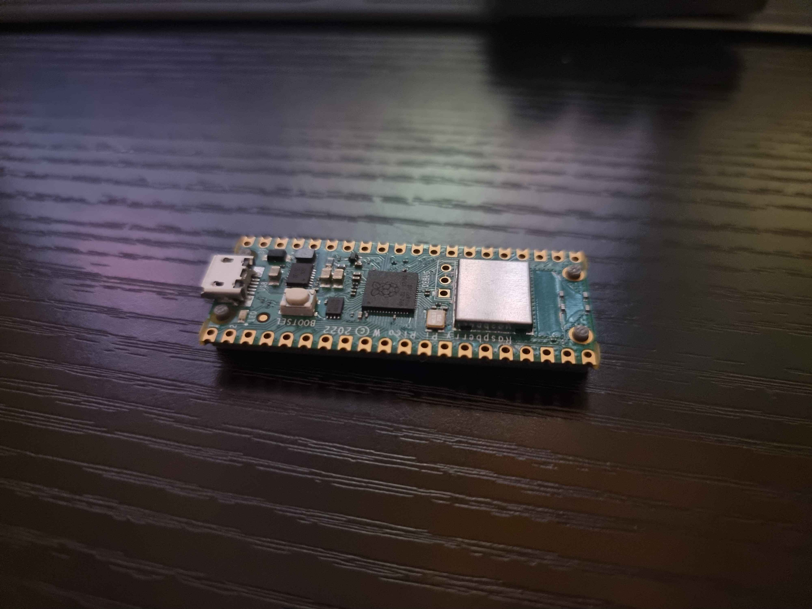
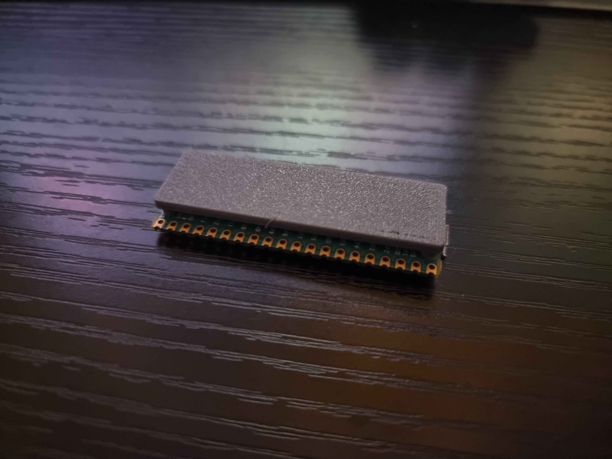
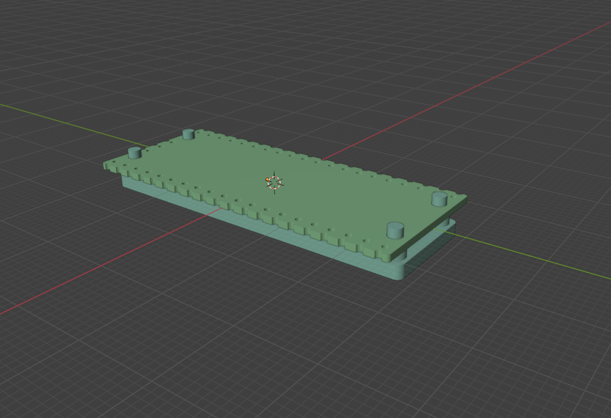

# Pi Pico Simple Platform

A simple platform that holds a Raspberry Pi Pico. It's mostly intended to be used as a base for other models such as a case.

## Files

| File                                                     | Description                             |
| -------------------------------------------------------- | --------------------------------------- |
| [pico-platform-nubs.stl](./files/pico-platform-nubs.stl) | Just the nubs for resting the pico on   |
| [pico-platform.stl](./files/pico-platform.stl)           | Nubs for pico mounted on a flat surface |

## Results

### Printed result

### Rendered in Blender with a Pico board example

